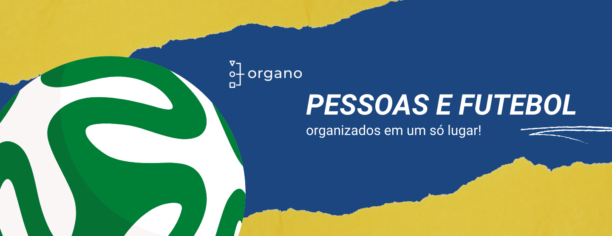

# OrganoFut
  
***Organization chart developed in the React course at @Alura Cursos.***

> Org chart designed to create soccer player cards

> Status: Finished... ✅ 

## Technologies 🚀

## License 📝

## LINKS 🔗

